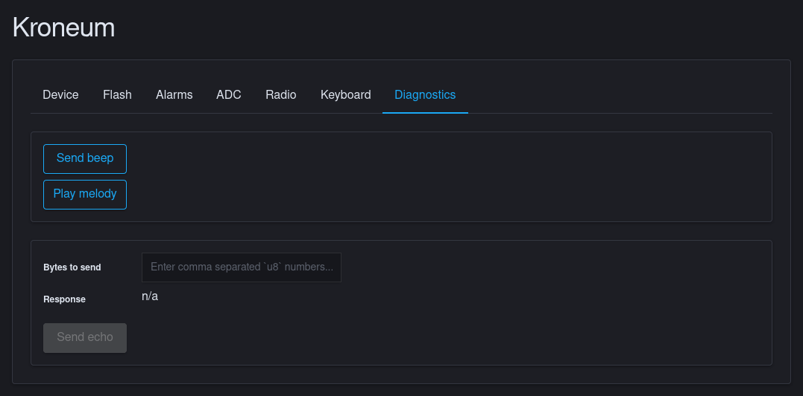
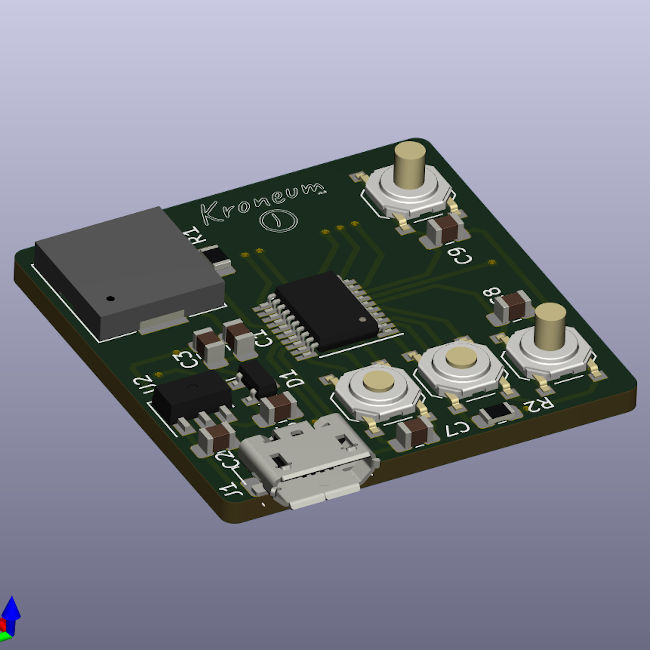
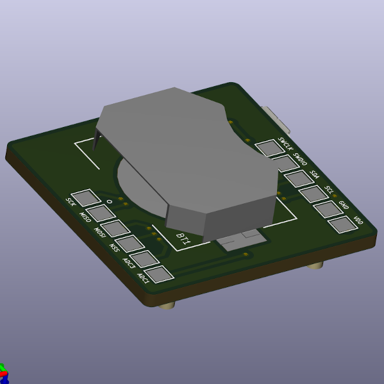
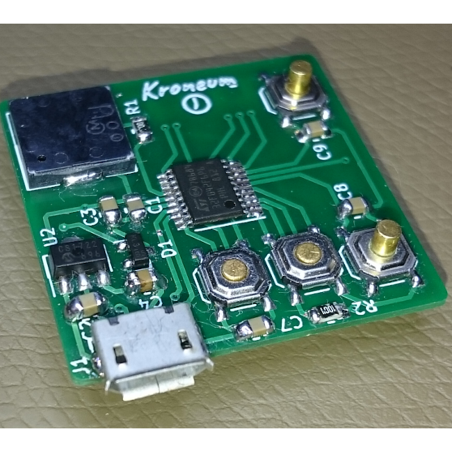
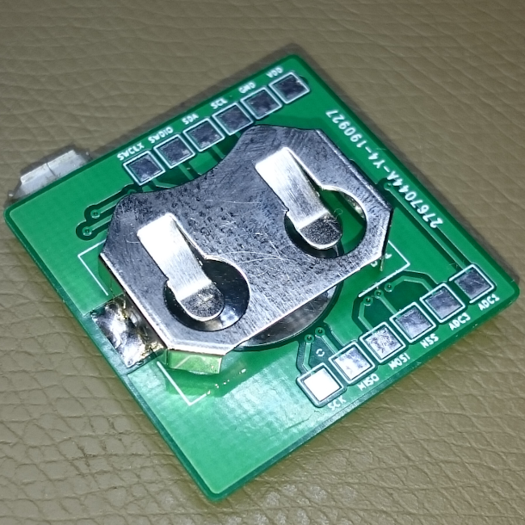
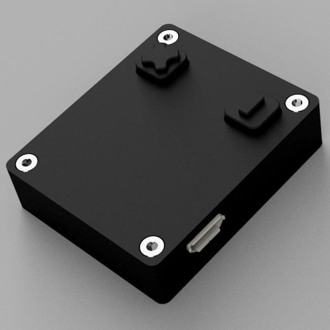

# 🕐 Kroneum

[](https://travis-ci.org/azasypkin/kroneum)

**Disclaimer:** I needed a dumb, autonomous, configurable and GUI-less physical timer to better manage my own time during the day and that is how Kroneum was born. 
Another goal was to see how well Rust fits into embedded development (basic interactions with MCU, USB stack and I2C driver).

------------------------

**Kroneum** is an experimental, accessible (no GUI) and fully open source (both in code and hardware) time tracker device.

There is neither GUI/LCD nor Wi-Fi/Bluetooth interface available, just two buttons one can use to configure the timer. More advanced users can use built-in USB functionality
to configure device (via dedicated [CLI tool](./sw/cli) with optional Web interface), upgrade firmware (via [DFU interface](./sw/firmware/README.md)) or upload various Krouneum "recipes" (e.g. to repurpose device completely).

## Usage

By default device stays in a standby low power mode and wakes up as soon as any of the button is being pressed for 3-5 seconds. As mentioned above there are just two buttons: **Ⅰ** (Roman `one`) and **Ⅹ** (Roman `ten`).

* Long press on **Ⅰ** or **Ⅹ** button when in `StandBy` mode - device enters into `Setup` mode
* Short press on **Ⅰ** when in `Setup` mode - increases desired timer by one `unit`
* Short press on **Ⅹ** when in `Setup` mode - increases desired timer by ten `units`
* Long press on **Ⅰ** when in `Setup` mode - sets timer treating `unit` as a `second` (see example below)
* Long press on **Ⅹ** when in `Setup` mode - sets timer treating `unit` as a `minute` (see example below)
* Long press on both **Ⅰ** *and* **Ⅹ** when in `Setup` mode - sets timer treating `unit` as an `hour` (see example below)
* Long press on **Ⅰ** *or* **Ⅹ** when in `Alarm` mode - resets current alarm if any and enters `Setup` mode
* Long press on both **Ⅰ** *and* **Ⅹ** when in `Alarm` mode - resets current alarm if any and enters `StandBy` mode
* **Very** long press (5 seconds) on both **Ⅰ** *and* **Ⅹ** - enters `Configuration` mode and powers up USB interface

Once timer fires up it will be repeated every 10 seconds (configurable) until it's acknowledged by the long press on both **Ⅰ** *and* **Ⅹ**.

## Examples:

* Long Press on **Ⅰ** + 5 short presses on **Ⅰ** + long press on **Ⅰ** = `5s` timer
* Long Press on **Ⅰ** + 5 short presses on **Ⅰ** + long press on **Ⅹ** = `5m` timer
* Long Press on **Ⅰ** + 5 short presses on **Ⅰ** + long press on both **Ⅰ** *and* **Ⅹ** = `5h` timer
* Long Press on **Ⅰ** + 1 short press on **Ⅰ** + 2 short presses on *Ⅹ** + long press on **Ⅰ** = `21s` timer
* Long Press on **Ⅰ** + 1 short press on **Ⅹ** + long press on **Ⅹ** = `10m` timer
* and so on

## Configuration

Advanced users can configure device via USB with the help of dedicated [CLI tool](./sw/cli), assuming device is in `Configuration` mode and
connected to the host PC via micro USB cable:

```bash
$ cargo run -- info

$ cargo run -- beep -n5

$ cargo run -- alarm get
$ cargo run -- alarm set "5m 15s"

$ cargo run -- flash read 0x1f
$ cargo run -- flash write 0x1f 10
$ cargo run -- flash erase

$ cargo run -- reset

```

It's also possible to use CLI tool as a standalone server with a minimalistic Web interface:

```bash
$ cargo run -- ui
  Running Kroneum Web UI on http://127.0.0.1:8080
``` 

Web server is bound to a local `http://127.0.0.1:8080` address and can be accessed with any modern browser:



Run `cargo run -- help` for more details.

**NOTE:** To use CLI tool without `root` privilege you may need to add the following `udev` rule:
```
/etc/udev/rules.d/50-kroneum.rules
----------
SUBSYSTEMS=="usb", ATTRS{idVendor}=="1209", ATTRS{idProduct}=="deed", GROUP="users", MODE="0660"
```

And then manually force `udev` to trigger this rule:
```bash
# udevadm trigger
```

In the future releases Web interface will be using [WebHID API](https://wicg.github.io/webhid/) completely eliminating the need in
the local Web server.

## Building custom firmware

If you feel adventurous you can easily build and flash custom firmware to Kroneum. You can use `./scripts/flash.sh` script 
from [fw](./sw/firmware) folder to build and flash default firmware or few custom [examples](./sw/firmware/bin/examples):

Default firmware:
```bash
# Default firmware
$ ./scripts/flash.sh 

# Example: blinking through TP1/SDA pad exposed on the back side of Kroneum PCB
$ ./script/flash.sh blinky

# Example: interfacing with SSD1306 LCD via TP1/SDA and TP2/SCL pads exposed on the back side of Kroneum PCB
$ ./script/flash i2c_ssd1306 
``` 

The `flash.sh` script is essentially consequent calls of `cargo build --release ...`, `cargo objcopy --release ...` and `dfu-util ...`.

## Prototype or DIY

Schematics is done in `KiCad` and can be found [here](./hw/pcb/Rev_0.5). PCB includes SWD, I2C and CR2032 connectors and may look a bit
oversized because of that, but on the bright side hand soldering and [CNC engraving](./hw/pcb/Rev_0.3/cnc) was a breeze.

The most recent enclosure was machined from 5mm (base and cap) and 2mm (buttons) Delrin and the older versions were machined from
5mm Plexiglas (walls and buttons) and 2mm Delrin (base and cap). G-Code can be found [here](./hw/enclosure/Rev_0.5/cnc).

See [PCB](./hw/pcb/Rev_0.6/demo) and [enclosure](./hw/enclosure/Rev_0.6/demo) renders and photos of how it turned in real:

#### PCB (rendered)




#### PCB (real)




#### Enclosure (rendered)


#### Enclosure (real)


<details>
  <summary><b>Older versions</b></summary>
 


</details>

-.- .-. --- -. . ..- --

